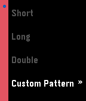
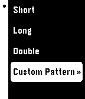

## action_menu_aplite

ActionMenu API for aplite (Pebble SDK2.0)

## Usage

It is the same API as basalt one : http://developer.getpebble.com/docs/c/User_Interface/Window/ActionMenu

## Example

 

